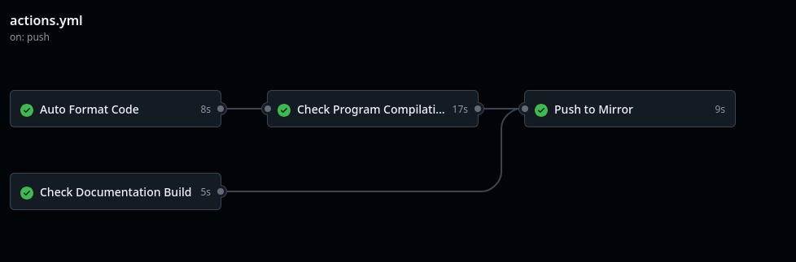

# R-TYPE

## Table of Contents

1. [General Info](#general-info)
2. [Technologies](#technologies)
3. [Installation](#installation)
4. [Overview](#overview)

### General Info

***
This project of the Advanced C++ knowledge unit will introduce you to networked video game
development, and will give you the opportunity to explore advanced development techniques
as well as to learn good software engineering practices.

The goal is to implement a multi-threaded server and a graphical client for a well-known legacy
video game called R-Type, using a game engine of your own design.

If you want to see the comparative analysis, read this: [Comparative Analysis](./ComparativeAnalysis.md)

### Technologies

***
A list of technologies used within the project:

* [C++](https://en.cppreference.com/w/): latest available
* [SFML](https://www.sfml-dev.org/index.php): latest available
* [ASTYLE](https://astyle.sourceforge.net/astyle.html): latest available

### Installation

***
A little intro about the installation.

Installation of dependencies is required:

Install Auto Format Code:

```bash
sudo sudo apt-get install -y astyle
```

Install SFML library:

```bash
sudo apt-get update
sudo apt-get install -y libsfml-dev
```

Clone and start the project:

```bash
git clone git@github.com:matheo2027/R-Type.git
cd ./R-Type

# If you want to compile the project :
./compile.sh

# If you want to create the documentation :
./StartDoc.sh

# If you want to delete all the documentation files and stop the project :
./StopAll.sh

cd build
./client/r-type_client
```
Don't forgot to ```chmod +x``` all the .sh files.
Before any push please make sure the code is formatted properly with ```Astyle```.

### Overview

***
Here are the different github actions for check compilation, building documentation and auto formatting before push to miror.



## Contributors

- matheo.piques@epitech.eu
- raphael.verrouil@epitech.eu
- raphael.fouche@epitech.eu
- babacar.sow@epitech.eu
